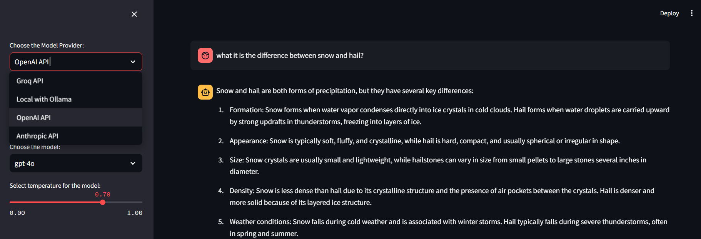

<div align="center">
  <h1>Streamlit-MultiChat</h1>
</div>

Use **many large language models**: OpenAI / Anthropic / Open / Local LLM's with **one Streamlit Web App**.


<div align="center">
  <a href="https://github.com/JAlcocerT/Streamlit-MultiChat?tab=GPL-3.0-1-ov-file" style="margin-right: 5px;">
    
  </a>
  <a href="https://github.com/JAlcocerT/Streamlit-MultiChat/actions/workflows/Streamlit_GHA_MultiArch.yml" style="margin-right: 5px;">
    
  </a>
  <a href="https://GitHub.com/JAlcocerT/Streamlit-Multichat/graphs/commit-activity" style="margin-right: 5px;">
    
  </a>
  <a href="https://www.python.org/downloads/release/python-312">
    
  </a>
</div>

## Features

* LLM Support
  * Ollama
  * OpenAI - GPT 3.5 / GPT4 / GPT4o / GPT4o-mini
  * Anthropic - Claude 3 (Opus / Sonnet) / Claude 3.5
  * Groq API

## Getting Started 

<details>
  <summary>Clone and Run 👇</summary>
  &nbsp;

Try the Project quickly with [Python Venv's](https://fossengineer.com/python-dependencies-for-ai/):

```sh
git clone https://github.com/JAlcocerT/Streamlit-MultiChat
python -m venv multichat_venv #create the venv

multichat_venv\Scripts\activate #activate venv (windows)
source multichat_venv/bin/activate #(linux)
```

```sh
pip install -r requirements.txt #all at once
streamlit run Z_multichat.py
```

* Make sure to have [Ollama ready](https://fossengineer.com/selfhosting-llms-ollama/) and running your desired model!
* Prepare the **API Keys** in any of:
    * .streamlit/secrets.toml
    * As Environment Variables
        * Linux - `export OPENAI_API_KEY="YOUR_API_KEY"`
        * CMD - `set OPENAI_API_KEY=YOUR_API_KEY`
        * PS - `$env:OPENAI_API_KEY="YOUR_API_KEY"`
        * In the [Docker-Compose](https://github.com/JAlcocerT/Streamlit-MultiChat/tree/main/Z_DeployMe)
    * Through the Streamlit UI
</details>


<div align="center">
  
  <p><em>Chat with Several Models with Streamlit</em></p>
</div>

* **Alternatively** - Use the [Docker Image](https://github.com/JAlcocerT/Streamlit-MultiChat/pkgs/container/streamlit-multichat)

```sh
docker pull ghcr.io/jalcocert/streamlit-multichat:latest #x86/ARM64
```

---

## Thanks to ❤️

Projects I got inspiration from / consolidated in this App were [tested here](https://github.com/JAlcocerT/Streamlit-MultiChat/tree/main/Z_Tests): `./Z_Tests`

<details>
  <summary>Check the Projects 👈</summary>
  &nbsp;

* https://github.com/dataprofessor/openai-chatbot

* https://github.com/AIDevBytes/Streamlit-Ollama-Chatbot

* https://github.com/tonykipkemboi/groq_streamlit_demo -> Groq + Streamlit Chat

* https://github.com/TirendazAcademy/Streamlit-Tutorials/blob/main/Blog-Generator-App-with-Claude-API/app.py
  * https://www.youtube.com/watch?v=ximj9QWle-g

* https://github.com/siddhardhan23/gemini-pro-streamlit-chatbot

</details>