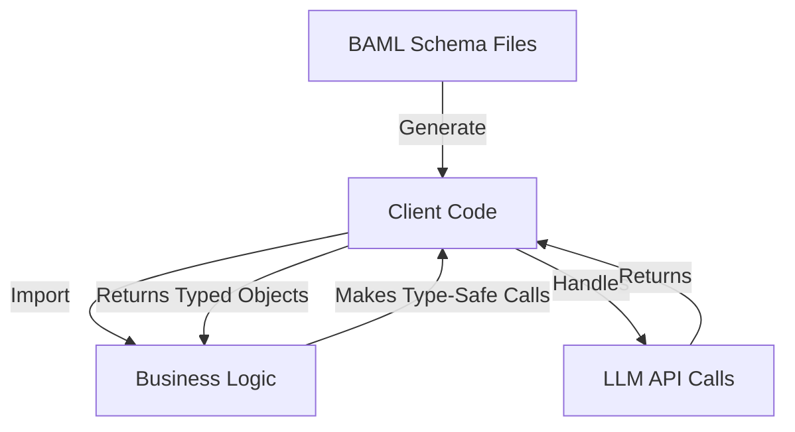

See [this post](https://jalcocert.github.io/JAlcocerT/ai-tools-for-cli/#baml)

---

# BAML: Boundary Markup Language

## Overview

BAML is a language and toolkit for creating reliable, type-safe interfaces to LLMs (Large Language Models). It allows you to define schemas for LLM interactions and generates client code that handles all the complexity of making reliable LLM calls.

## Architecture



### Key Components

#### 1. BAML Schema Files (*.baml)

These files define the contract between your application and LLMs:

- **Classes**: Define data structures for inputs and outputs
- **Functions**: Define the operations that call LLMs
- **Clients**: Configure which LLM providers to use
- **Tests**: Define test cases to validate behavior

Example:
```
// Define input structure
class TestInput {
  message string
}

// Define output structure
class TestOutput {
  response string
}

// Define function
function TestFunction(input: TestInput) -> TestOutput {
  client SomeModel
  prompt #"
    {{ input.message }}
  "#
}

// Define the LLM client
client<llm> SomeModel {
  provider openai
  options {
    model "gpt-4o-mini"
    api_key env.OPENAI_API_KEY
    temperature 0.2
  }
}
```

#### 2. Generated Client Code (baml_client/)

BAML automatically generates a client library with:

- **Type Definitions**: Pydantic models for your data structures
- **Client Classes**: Sync and async clients for making LLM calls
- **Runtime Support**: Error handling, retries, validation, etc.

Structure:
- `sync_client.py`: Synchronous API client
- `async_client.py`: Asynchronous API client
- `types.py`: Generated data models
- And many support files (parsing, streaming, etc.)

#### 3. Your Business Logic

Your application code imports the generated client and uses it to make type-safe LLM calls:

```python
# Import the client
from baml_client import b
from baml_client.types import TestInput

# Make a type-safe call
result = b.TestFunction(input=TestInput(message="Hello, what is BAML?"))

# Use the strongly-typed response
print(f"Response: {result.response}")
```

## Workflow

1. **Define your schema** in `.baml` files
2. **Generate client code** with:
   ```
   npx @boundaryml/baml generate
   # or
   baml-cli generate
   ```
3. **Import and use** the generated client in your business logic
4. When you need to **change your LLM interface**, modify BAML files and re-generate

## Common Pitfalls

1. **Not regenerating after schema changes**: Always regenerate client code after modifying BAML files
2. **Incorrect function calls**: 
   - ❌ `b.TestFunction(message="Hello")` 
   - ✅ `b.TestFunction(input=TestInput(message="Hello"))`
3. **Missing environment variables**: Ensure API keys are properly set

## Core Architecture Concept

BAML's architecture is centered around a clear separation of concerns:

1. **BAML Schema (`baml_src/*.baml` files)**: 
   - Define the contract/interface 
   - Specify what functions exist, what data types they use
   - Configure which LLM providers to call

2. **Generated Client Code (`baml_client/` folder)**: 
   - Handles all the technical details of calling models correctly
   - Manages parsing responses, error handling, retry logic
   - Provides type-safe interfaces for your business logic

3. **Your Business Logic** (like `plan_enhancement_baml.py`): 
   - Only needs to import and use the generated clients
   - Focuses purely on solving your business problem
   - Remains clean and readable

This architecture means your main Python files can remain focused on business logic, while all the complexity of reliable LLM calling is abstracted away in the generated client code.

## Benefits

- **Type Safety**: Compile-time checking for LLM interactions
- **Maintainability**: Change models without changing business code
- **Testability**: Built-in testing framework
- **Separation of Concerns**: Business logic separate from LLM interaction details

## Additional Resources

- [BAML Documentation](https://docs.boundaryml.com)
- [GitHub Repository](https://github.com/boundaryml/baml)
- [Discord Community](https://discord.gg/boundaryml)


---

# Documentation Enhancement Scripts

This repository contains different implementations for generating documentation enhancement recommendations using OpenAI APIs.

## Available Scripts

There are two main approaches implemented:

### 1. Basic JSON Mode Script

```sh
# Run with a specific document path
python3 plan_enhancement_python.py --doc-path /path/to/your/documentation.md

# Run with a specific model (default is gpt-4o-mini)
python3 plan_enhancement_python.py --doc-path /path/to/your/documentation.md --model gpt-4o
```

### 2. Function Calling Script

```sh
# Run with a specific document path
python3 plan_enhancement_function_calling.py --doc-path /path/to/your/documentation.md

# Run with a specific model (default is gpt-4o-mini)
python3 plan_enhancement_function_calling.py --doc-path /path/to/your/documentation.md --model gpt-4o
```

### 3. BAML Script

```sh
# Run with a specific document path
python plan_enhancement_baml.py --doc-path /home/jalcocert/Desktop/IT/wk28/project-documentation-generator/docs/src/content/docs/reference/reference-default/index.md

uv run plan_enhancement_baml.py --doc-path /home/jalcocert/Desktop/IT/wk28/project-documentation-generator/docs/src/content/docs/reference/reference-default/index.md

# Or set it via environment variable
export DOC_PATH=/home/jalcocert/Desktop/IT/wk28/project-documentation-generator/docs/src/content/docs/reference/reference-default/index.md
python plan_enhancement_baml.py
```

## Differences Between Approaches

### JSON Mode (plan_enhancement_python.py)

- Uses OpenAI's `response_format={"type": "json_object"}` parameter
- Simpler implementation with fewer lines of code
- Returns basic JSON structure with just recommendation text
- No schema enforcement beyond being valid JSON
- Output is saved to `enhancement_plan.json`

### Function Calling (plan_enhancement_function_calling.py)

- Uses OpenAI's function calling with `tools` and `tool_choice="auto"`
- Provides a detailed schema for the model to follow
- Returns richer data with priority levels and rationales
- Enforces structure through the function schema
- Output is saved to `enhancement_plan_function_calling.json`

### BAML (plan_enhancement_baml.py)

- Uses BAML for declarative schema definitions
- Provides strong typing through Pydantic models
- Separates schema definitions from business logic
- Handles the same rich data structure with priority and rationale
- Output is saved to `enhancement_plan_baml.json`

---

## BAML Architecture & Implementation

BAML (Boundary AI Markup Language) provides a declarative way to define AI interactions with strong typing. Here's how it works in this project:

### Key Files and Their Relationships

1. **Schema Definition** (`baml_src/doc_enhancement.baml`):
   - Defines the data structures and function signatures
   - Contains class definitions for inputs and outputs
   - Specifies the OpenAI client configuration
   - Declares prompts and system messages

2. **Generated Client** (`baml_client/` directory):
   - Auto-generated from BAML definitions
   - Contains Pydantic models for type checking
   - Provides a strongly-typed client interface
   - Generated using `npx @boundaryml/baml generate` command

3. **Python Implementation** (`plan_enhancement_baml.py`):
   - Imports the generated BAML client
   - Handles business logic like loading files and parsing arguments
   - Makes type-safe API calls using the client
   - Processes and formats the results

### Workflow

```
┌────────────────────┐     ┌────────────────────┐     ┌────────────────────┐
│                    │     │                    │     │                    │
│  doc_enhancement.  │     │ npx @boundaryml/  │     │                    │
│       baml         │────▶│  baml generate     │────▶│   baml_client/     │
│  (Schema & Client  │     │ (Code Generation) │     │ (Generated Code)   │
│    Definition)     │     │                    │     │                    │
│                    │     │                    │     │                    │
└────────────────────┘     └────────────────────┘     └────────────────────┘
                                                               │
                                                               │
                                                               ▼
┌────────────────────┐     ┌────────────────────┐     ┌────────────────────┐
│                    │     │                    │     │                    │
│ enhancement_plan_  │     │plan_enhancement_   │     │                    │
│      baml.json     │◀────│      baml.py       │◀────│  Import & Use      │
│  (Output Results)  │     │(Business Logic &   │     │  Generated Client  │
│                    │     │   API Calls)       │     │                    │
│                    │     │                    │     │                    │
└────────────────────┘     └────────────────────┘     └────────────────────┘
```

### BAML Schema Explained

```baml
// Define input and output structures
class EnhancementInput {
  documentation string
  prompt string
  system_message string
}

class Recommendation {
  recommendation string
  priority string?  // Optional field with '?'
  rationale string?
}

class EnhancementPlan {
  recommendations Recommendation[]
}

// Define the function for API calls
function EnhanceDocumentation(input: EnhancementInput) -> EnhancementPlan {
  client DocEnhancementModel  // Use this client for the call
  
  prompt #"
    {{ input.system_message }}
    {{ input.prompt }}
    // Templated prompt with inputs
  "#
}

// Configure the OpenAI client
client<llm> DocEnhancementModel {
  provider openai
  options {
    model "gpt-4o-mini"
    api_key env.OPENAI_API_KEY
    response_format { type "json_object" }
  }
}
```

### How to Use BAML

1. **Define your schema** in `.baml` files
2. **Generate the client code** with `npx @boundaryml/baml generate`
3. **Import the generated client** in your Python code
4. **Make type-safe API calls** using the client

This approach separates the AI schema definition from business logic, making your code more maintainable and providing compile-time type checking.

## Further Explanation: Type-Safe & Declarative vs. Schema-Defined

The type-safe, declarative approach (BAML) offers several significant advantages over just schema-defined approaches (like function calling):

### 1. Compile-Time Validation vs. Runtime Validation

**Function Calling:**
- Schema validation happens at runtime
- Errors in schema structure are only discovered when the API is called
- Typos or incorrect field types aren't caught until execution

**BAML:**
- Validation happens at compile/generation time
- The code generator catches errors before your application runs
- IDE can provide immediate feedback on type mismatches

### 2. Language Integration

**Function Calling:**
- Schema is defined as a JSON structure in your code
- No native language integration with your programming language
- No autocomplete or type hints in your IDE

**BAML:**
- Generates native language bindings (Pydantic models in Python)
- Full IDE support with autocomplete and type hints
- Seamless integration with the language's type system

### 3. Separation of Concerns

**Function Calling:**
- Schema definition mixed with business logic
- Changes to schema require modifying application code
- Difficult to reuse schemas across different applications

**BAML:**
- Clear separation between schema and implementation
- Schemas defined in dedicated `.baml` files
- Easy to reuse schemas across multiple applications

### 4. Real-world Example from Our Implementation

**Function Calling Implementation:**
```python
# Schema mixed with business logic
tools = [{
    "type": "function",
    "function": {
        "name": "generate_documentation_recommendations",
        "description": "Generate recommendations for improving documentation",
        "parameters": {
            "type": "object",
            "properties": {...},
            "required": [...]
        }
    }
}]

response = client.chat.completions.create(
    model="gpt-4o-mini",
    messages=[...],
    tools=tools,
    tool_choice="auto"
)

# Manual extraction and processing of response
tool_call = response.choices[0].message.tool_calls[0]
recommendations = json.loads(tool_call.function.arguments)
```

**BAML Implementation:**
```python
# Clean business logic with type-safe API calls
from baml_client import EnhanceDocumentation

result = EnhanceDocumentation(
    input=EnhancementInput(
        documentation=doc_content,
        prompt=prompt_content,
        system_message=system_message
    )
)

# Type-safe access to results
for rec in result.recommendations:
    print(f"{rec.recommendation}, Priority: {rec.priority}")
```

## BAML and Pydantic: The Relationship

BAML and Pydantic work together to provide a robust type-safe experience:

### 1. Code Generation Process

- **BAML Schema**: You define classes and types in `.baml` files
- **Code Generator**: The BAML CLI tool reads these definitions
- **Generated Models**: Converts BAML classes into Pydantic models

### 2. How They Integrate

- **Pydantic Models**: Generated for each BAML class
  ```python
  # Generated from BAML class Recommendation
  class Recommendation(BaseModel):
      recommendation: str
      priority: Optional[str] = None
      rationale: Optional[str] = None
  ```

- **Validation**: Pydantic provides validation for all fields
  ```python
  # This will raise a validation error if recommendation is missing
  rec = Recommendation(priority="high", rationale="Important")
  ```

- **Type Hints**: IDE tools recognize Pydantic types
  ```python
  # Your IDE will suggest .recommendation, .priority, etc.
  result.recommendations[0].
  ```

### 3. Benefits of the Integration

- **Schema Evolution**: Change your BAML schema and the Pydantic models update automatically
- **Documentation**: Generated Pydantic models include docstrings from BAML
- **Serialization**: Easy conversion between JSON and Python objects
- **Compatibility**: Works with FastAPI and other Pydantic-based frameworks

This tight integration between BAML's declarative schema language and Pydantic's runtime validation creates a seamless developer experience with the benefits of both worlds.

## The Generated Client Code: Purpose and Necessity

### What the Generated Client Code Does

The BAML client code generation step (`npx @boundaryml/baml generate`) creates several important components:

1. **Type Definitions**
   - Pydantic models for all BAML classes
   - Type hints for function parameters and return values
   - Runtime validation logic for all data structures

2. **API Client Implementation**
   - HTTP request handling to the LLM provider
   - Authentication and API key management
   - Request formatting with proper headers and JSON structure
   - Response parsing and error handling

3. **Prompt Template Processing**
   - Logic to fill in template variables
   - Conversion of user inputs into properly formatted prompts
   - Handling of conditional logic in templates

4. **Function Wrappers**
   - Python functions that map to your BAML functions
   - Parameter validation before API calls
   - Response processing after API calls

### Why Client Generation is Necessary

Without generated clients, you would need to:

1. **Write Boilerplate Code Manually**
   - Implement all Pydantic models by hand
   - Create and maintain HTTP client code
   - Handle serialization/deserialization logic
   - Update all code when schemas change

2. **Lose Type Safety Benefits**
   - No automatic validation of inputs and outputs
   - No IDE autocomplete for nested structures
   - Runtime errors instead of compile-time checks

3. **Mix Schema and Implementation**
   - No clear separation between data models and business logic
   - Schema changes would require modifying application code
   - More difficult to maintain as project grows

### Inside the Generated Client

A simplified view of what the generated client contains:

```python
# Generated Pydantic models
class EnhancementInput(BaseModel):
    documentation: str
    prompt: str
    system_message: str

class Recommendation(BaseModel):
    recommendation: str
    priority: Optional[str] = None
    rationale: Optional[str] = None

class EnhancementPlan(BaseModel):
    recommendations: List[Recommendation]

# Generated client function
def EnhanceDocumentation(input: EnhancementInput) -> EnhancementPlan:
    # 1. Validate input using Pydantic
    validated_input = EnhancementInput(**input) if isinstance(input, dict) else input
    
    # 2. Format the prompt with template variables
    prompt_text = format_template(
        template="{{input.system_message}}\n\n{{input.prompt}}\n\nDocumentation content:\n{{input.documentation}}",
        variables={"input": validated_input}
    )
    
    # 3. Make the API call with proper formatting
    response = openai_client.chat.completions.create(
        model="gpt-4o-mini",
        messages=[{"role": "user", "content": prompt_text}],
        response_format={"type": "json_object"}
    )
    
    # 4. Parse and validate the response
    try:
        json_response = json.loads(response.choices[0].message.content)
        return EnhancementPlan(**json_response)
    except Exception as e:
        raise BAMLClientParsingError(f"Failed to parse response: {e}")
```

This generated code handles all the complex interaction with the OpenAI API, validation of inputs/outputs, and error handling, allowing your application code to remain clean and focused on business logic.

### What BAML Actually Does (and Doesn't Do)

It's important to understand what BAML does and doesn't do for type safety:

**What BAML Does:**

1. **Type-safe Input/Output Handling**:
   - Defines data structures in a declarative language
   - Generates Pydantic models for runtime type checking
   - Validates inputs before sending to LLM and outputs after receiving responses

2. **API Integration Management**:
   - Generates all the code needed to connect to the LLM provider (OpenAI in our case)
   - Handles authentication, request formatting, response parsing

3. **Prompt Engineering**: 
   - Uses your defined templates from BAML files
   - Handles variable interpolation in prompts

4. **Response Format Enforcement**:
   - Sets the appropriate parameters like `response_format={"type": "json_object"}`
   - Processes and validates the response through Pydantic models

**What BAML Doesn't Do:**

1. **Magically Make LLM Outputs Type-Safe**:
   - BAML doesn't modify your prompts to ensure type safety
   - The LLM could still generate invalid responses
   - BAML will catch these invalid responses through Pydantic validation

2. **Replace Good Prompt Engineering**:
   - You still need to write clear prompts that guide the LLM
   - BAML provides the structure, but you provide the guidance

The type safety comes from the combination of:
- The schema you defined (which becomes Pydantic models)
- The response format configuration in the API call
- The runtime validation after the response is received

BAML's power is that it generates all the infrastructure to properly request, validate, and process responses according to your defined schema, letting you focus on defining your schema and business logic without writing boilerplate code.

## BAML Workflow

The typical development workflow when using BAML follows these steps:

1. **Define Your Schema in BAML** (`baml_src/doc_enhancement.baml`):
   - Create data structures (input/output classes)
   - Define functions with their input/output types
   - Configure LLM clients and prompt templates

2. **Generate the Client Code**:
   - This creates **Pydantic models and API client** code in `baml_client/`

3. **Write Your Business Logic** (`plan_enhancement_baml.py`):
   - Import the generated client
   - Handle file I/O, argument parsing, etc.
   - Call the BAML functions and process results

4. **Iterate When Needed**:
   - If you need to change schemas or prompts, modify the BAML file
   - Regenerate the client code
   - Update your Python script if necessary

This separation helps maintain a clean architecture where:
- BAML files handle the "what" (data structures and LLM interactions)
- Python code handles the "how" (business logic, file handling, etc.)

## Step-by-Step Project Setup Guide

To set up a new BAML project that generates Python clients (not TypeScript), follow these exact steps:

### 1. Project Structure Setup

```bash
# Create project directory and subdirectories
mkdir -p my_baml_project/baml_src
cd my_baml_project

# Initialize package dependencies
pip install baml-py openai python-dotenv pydantic
```

### 2. Create BAML Configuration File

Create a `baml.json` file in the root directory with these exact contents:

```json
{
  "language": "python",
  "outDir": "./baml_client"
}
```

### 3. Define Your BAML Schema Files

Create these files in the `baml_src` directory:

**`baml_src/clients.baml`**:
```
// Define generic clients for reuse
```

**`baml_src/openai_models.baml`**:
```
// OpenAI-specific client configurations
client<llm> GPT4Model {
  provider openai
  options {
    model "gpt-4o-mini"
    api_key env.OPENAI_API_KEY
    temperature 0.2
    response_format { type "json_object" }
  }
}
```

**`baml_src/your_schema.baml`**:
```
// Define your schema here
```

### 4. Generate BAML Client

```bash
# Generate Python client code
# npx @boundaryml/baml generate
#uv init
uv add baml-py
#uv add pydantic
#uv add typing-extensions
#uv add baml-py pydantic typing-extensions

uv run baml-cli init #https://docs.boundaryml.com/guide/installation-language/python
uv run baml-cli generate #generates ./baml_client python files
```

### 5. Verify Python Client Generation

Check that Python files (not TypeScript) were generated:

```bash
ls -l baml_client/*.py
```

If you see `.ts` files instead of `.py` files, ensure your `baml.json` file is in the right location with the correct content.

### 6. Write Your Python Implementation

Create a Python file that uses your generated client:

```python
# your_implementation.py
from dotenv import load_dotenv
from baml_client import YourFunction

load_dotenv()

result = YourFunction(...)
print(result)
```

### 7. Run Your Implementation

```bash
python your_implementation.py
```

### Troubleshooting

If BAML generates TypeScript files instead of Python files:

1. Ensure `baml.json` is in the root directory with `"language": "python"`
2. Make sure you have `baml-py` installed
3. If problems persist, try:
   ```bash
   BAML_LANGUAGE=python npx @boundaryml/baml generate
   ```

### Example Function Calling Output

```json
{
  "recommendations": [
    {
      "recommendation": "Expand on advanced topics...",
      "priority": "high",
      "rationale": "Developers need to understand..."
    }
  ]
}
```

## Environment Setup

Both scripts require an OpenAI API key, which should be set in a `.env` file:

```
OPENAI_API_KEY=your_api_key_here
```

You can also set the documentation path via environment variable:

```sh
export DOC_PATH=/path/to/your/documentation.md
python3 plan_enhancement_python.py
```