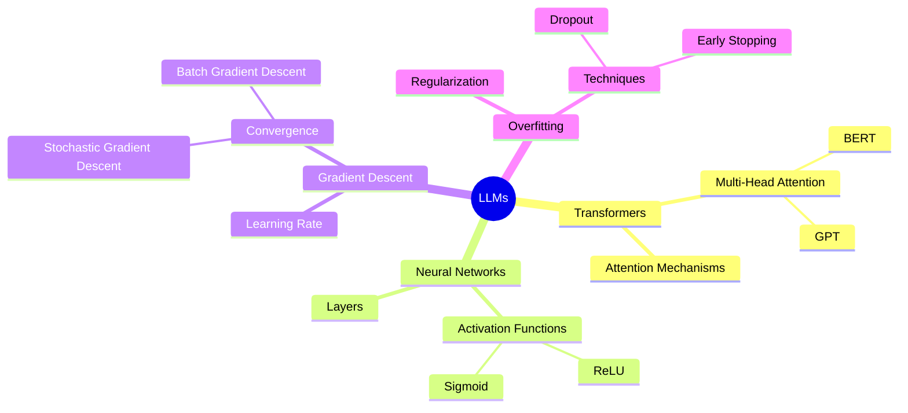
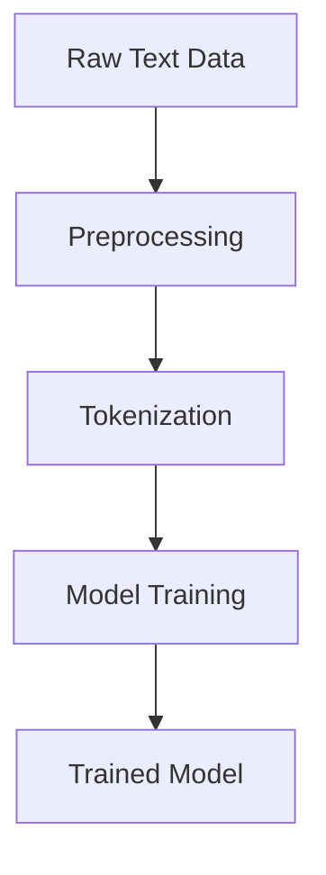
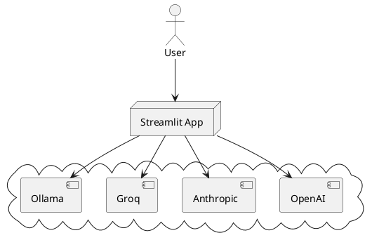

---
# You can also start simply with 'default'
theme: seriph
# random image from a curated Unsplash collection by Anthony
# like them? see https://unsplash.com/collections/94734566/slidev
background: https://cover.sli.dev
# some information about your slides (markdown enabled)
title: Streamlit Multichat
info: |
  ## Setup your ChatBot
# apply unocss classes to the current slide
class: text-left
# https://sli.dev/custom/highlighters.html
highlighter: shiki
# https://sli.dev/guide/drawing
drawings:
  persist: false
# slide transition: https://sli.dev/guide/animations#slide-transitions
transition: slide-left
# enable MDC Syntax: https://sli.dev/guide/syntax#mdc-syntax
mdc: true
download: true
# favicon, can be a local file path or URL
favicon: 'favicon.ico' #'./JAT.svg' #'https://cdn.jsdelivr.net/gh/slidevjs/slidev/assets/favicon.png
---

# Streamlit MultiChat

Chat with multiple LLMs from one App.

<div class="pt-12">
  <span @click="$slidev.nav.next" class="px-2 py-1 rounded cursor-pointer" hover="bg-white bg-opacity-10">
    Press Space and Check how it's built <carbon:arrow-right class="inline"/>
  </span>
</div>

<div class="abs-br m-6 flex gap-2">
  <button @click="$slidev.nav.openInEditor()" title="Open in Editor" class="text-xl slidev-icon-btn opacity-50 !border-none !hover:text-white">
    <carbon:edit />
  </button>
  <a href="https://github.com/JAlcocerT/Streamlit-Multichat" target="_blank" alt="GitHub" title="Open in GitHub"
    class="text-xl slidev-icon-btn opacity-50 !border-none !hover:text-white">
    <carbon-logo-github />
  </a>
</div>

<!--
The last comment block of each slide will be treated as slide notes. It will be visible and editable in Presenter Mode along with the slide. [Read more in the docs](https://sli.dev/guide/syntax.html#notes)
-->


---
layout: two-cols
layoutClass: gap-16
---

# Why Streamlit for a MultiChat App?

Streamlit can help to create a unified MultiChat app with Language Learning Models (LLMs)

- 🔄 **Unified Experience** - Select different LLM providers from one place, without switching between platforms.
- 👥 **Multi-User Support** - Handle multiple users and conversations at once.
- 🛠 **Customizable** - Easily adapt the app to different learning methods and requirements.
- 🌐 **Web-Based** - Access your MultiChat app from anywhere, on any device.

::right::

<Toc v-click minDepth="1" maxDepth="2"></Toc>

---

# The Context of LLMs

Clarifying AI/ML/Neuronal Networks. 

There is really Math intensive stuff going on here:

<div style="text-align: center;">

$$
\theta = \theta - \alpha \cdot \nabla_\theta J( \theta),
$$
</div> 


But, we dont need to go into Math details. Just **keep in mind**:

<div style="text-align: center;">


</div> 

ML Resources - [The ML Map](https://scikit-learn.org/dev/machine_learning_map.html).


---
transition: fade-out
---

# What is Streamlit?

Streamlit is a fast, user-friendly tool to create custom web apps for machine learning and data science, offering the following features:

- 📝 **Code-based** - Create web apps using Python scripts, focusing on data and models first.
- 🎨 **Customizable** - Easily design your app's layout and appearance.
- 🧑‍💻 **Developer Friendly** - Built for developers with features like hot-reloading and modular code.
- 🤹 **Interactive** - Easily add widgets like sliders, dropdowns, and buttons to interact with your data.
- 📊 **Data-Ready** - Built-in support for displaying data frames, charts, and other visualizations.
- 🚀 **Fast Deployment** - One-click deployment to share your apps with the world.


<br>
<br>

Read more about [Why Streamlit?](https://streamlit.io/why-streamlit)


<!--
You can have `style` tag in markdown to override the style for the current page.
Learn more: https://sli.dev/guide/syntax#embedded-styles
-->

<style>
h1 {
  background-color: #2B90B6;
  background-image: linear-gradient(45deg, #4EC5D4 10%, #146b8c 20%);
  background-size: 100%;
  -webkit-background-clip: text;
  -moz-background-clip: text;
  -webkit-text-fill-color: transparent;
  -moz-text-fill-color: transparent;
}
</style>

<!--
Here is another comment.
-->

---
transition: slide-up
level: 2
---

# What's based on?

Three 3rd Party API's and Local LLMs with [Ollama](https://fossengineer.com/selfhosting-llms-ollama/)

* Streamlit provides the UI + Call the selected API as per user request
## Supported LLMs

|     |     |
| --- | --- |
| <kbd>OpenAI API</kbd> | Most Popular Propietary LLMs (ATM) |
| <kbd>Anthropic API</kbd>  | The challenger of the LLM's Throne |
| <kbd>Groq API</kbd> | Fast Inference with Free Models (Ex: Llama2-70B) |
| <kbd>Ollama API</kbd> | Also local LLMs! |

* LLM's Leaderboard - [Arena to fight!](https://chat.lmsys.org/?leaderboard)
  * Crowdsourced, randomized LLM battle platform.

---

## The AI App Architecture

You can create diagrams / graphs from textual descriptions, directly in your Markdown.

<div class="grid grid-cols-2 gap-5 pt-4 -mb-6">






</div>

[Learn More](https://sli.dev/guide/syntax.html#diagrams)


---
layout: image-right
image: https://cover.sli.dev
---

## Code

No need to get scared, **Streamlit** makes it simple:

```py {all|1|3-4|6-7} twoslash
import streamlit as st

# Create a slider widget
slider_value = st.slider('Select a value:', 0, 10)

# Display the selected value
st.write(f'You selected {slider_value}')
```

<arrow v-click="[1, 2]" x1="400" y1="150" x2="250" y2="165" color="#953" width="2" arrowSize="1" />

* Install [Streamlit with Python](https://pypi.org/project/streamlit/) - PyPi
  * Just a **P**ackage **I**ndex for 🐍


<!-- Footer -->
[^1]: [Learn More](https://sli.dev/guide/syntax.html#line-highlighting)

<!-- Inline style -->
<style>
.footnotes-sep {
  @apply mt-5 opacity-10;
}
.footnotes {
  @apply text-sm opacity-75;
}
.footnote-backref {
  display: none;
}
</style>

<!--
Notes can also sync with clicks

[click] This will be highlighted after the first click

[click] Highlighted with `count = ref(0)`

[click:3] Last click (skip two clicks)
-->

---
level: 1
---

# How it Works

It's all about proper API calls with Python packages!

The App checks first if we have provided the **credentials first** for the selected API with this kind of conditions:

````md magic-move {lines: true}
```py {*|2|*}
#step 1 - The code checks the API Keys
if 'OPENAI_API_KEY' in st.secrets and len(st.secrets['OPENAI_API_KEY']) > 30:
    st.success('API key already provided!', icon='✅')
    openai.api_key = st.secrets['OPENAI_API_KEY']
else:
    openai.api_key = st.text_input('Enter OpenAI API token:', type='password')
    if not (openai.api_key.startswith('sk-') and len(openai.api_key) > 30):
        st.warning('Please, enter your credentials', icon='⚠️')
    else:
        st.success('Proceed with your Prompts!', icon='👉')
```

```py {*|1-2|3-4|3-4,8}
// step 2 - We indicate the API compatible LLMs
model_choice = st.selectbox(
            'Choose the model:',
            ['gpt-3.5-turbo', 'gpt-4-turbo-preview', 'gpt-4o'],
            index=0
        )
```

```py
# step 3 - And we add the possibility to tweak the 'Creativity'
temperature = st.slider(
    'Select temperature for the model:',
    min_value=0.0,
    max_value=1.0,
    value=0.7, #BE CREATIVE! versus BE STRICT TO THE BOOK!
    step=0.01
)
```

Non-code blocks are ignored. This is Ignored!

```vue
for response in openai.ChatCompletion.create(
                model=model_choice,
                messages=[{"role": m["role"], "content": m["content"]}
                          for m in st.session_state.messages], 
                temperature=temperature,  # Use the selected temperature here
                stream=True):
                full_response += response.choices[0].delta.get("content", "")
                message_placeholder.markdown(full_response + "▌")
            message_placeholder.markdown(full_response)
```
````

---

# The App's Modularity

<div grid="~ cols-2 gap-4">
<div>

Whenever a **new models appears**, adding its just about adding it in the config:

```py
model = st.selectbox(
    "Select Model", 
    ("claude-3.5-sonnet-20240620","claude-3-opus-20240229", "claude-3-sonnet-20240229")
)
```

And that's it, the app now allows to use the **latest Anthropic Model**

<!-- ./components/Counter.vue -->
<!-- <Counter :count="10" m="t-4" />

Check out [the guides](https://sli.dev/builtin/components.html) for more. -->

</div>
<div>

Sample of very recent anouncements...

<Tweet id="1803790676988920098" scale="0.45" />

</div>
</div>

<!--
Presenter note with **bold**, *italic*, and ~~striked~~ text.

Also, HTML elements are valid:
<div class="flex w-full">
  <span style="flex-grow: 1;">Left content</span>
  <span>Right content</span>
</div>
-->

---
hideInToc: true
class: px-20
---

# Themes

Slidev comes with powerful theming support.

Themes can provide styles, layouts, components, or even configurations for tools. Switching between themes by just **one edit** in your frontmatter:

<div grid="~ cols-2 gap-2" m="t-2">

```yaml
---
theme: default
---
```

```yaml
---
theme: seriph
---
```


</div>

Read more about [How to use a theme](https://sli.dev/themes/use.html) and
check out the [Awesome Themes Gallery](https://sli.dev/themes/gallery.html).

---

# How to use Streamlit MultiChat

This sounds interesting - How can I try the project?

<div v-click>

To use it, you can use the **Container Image** that it is ready at **[ghcr](https://github.com/JAlcocerT/Streamlit-MultiChat/pkgs/container/streamlit-multichat)**:

```sh
podman pull ghcr.io/jalcocert/streamlit-multichat:latest
```

* The container is built with [Github Actions](https://github.com/JAlcocerT/Streamlit-MultiChat/blob/main/.github/workflows/Streamlit_GHA_MultiArch.yml), btw!

</div>

<br>

<v-click>

The Streamlit Multichat needs the following **artifacts to run**:

* For 3rd party providers, <span v-mark.red="3"><code>Models API</code> endpoints</span>
you need to run the Ollama server first.
  * The magic happens as `.streamlit/secrets.toml`

```toml
# .streamlit/secrets.toml
OPENAI_API_KEY = "your_openai_api_key_here"
GROQ_API_KEY = "your_groq_api_key_here"
ANTHROPIC_API_KEY = "your_anthropic_api_key_here"
```

* To have the <span v-mark.red="3"><code>local LLMs</code> with Ollama</span>
you need to run the Ollama server first.

> <span v-mark.circle.orange="4">Docker/Podman</span> - Step by Step [Ollama Setup](https://fossengineer.com/selfhosting-llms-ollama/):

</v-click>

<div mt-20 v-click>

[Learn More](https://fossengineer.com/docker-alternatives-for-data-analytics/)

</div>


---
layout: center
class: text-center
hideInToc: true
---

# Thanks for your Time

Q&A Session

[Documentation](https://fossengineer.com/create-streamlit-chatgpt/) · [GitHub](https://github.com/JAlcocerT/Streamlit-MultiChat) · [Showcase](https://chat.iotechcrafts.com/) · [PPT Guide](https://fossengineer.com/how-to-use-slidev/)

<PoweredBySlidev mt-10 />

```sh
npm init slidev
npm i -D playwright-chromium

slidev build --base /Streamlit-Multichat --download
#slidev build --download
```