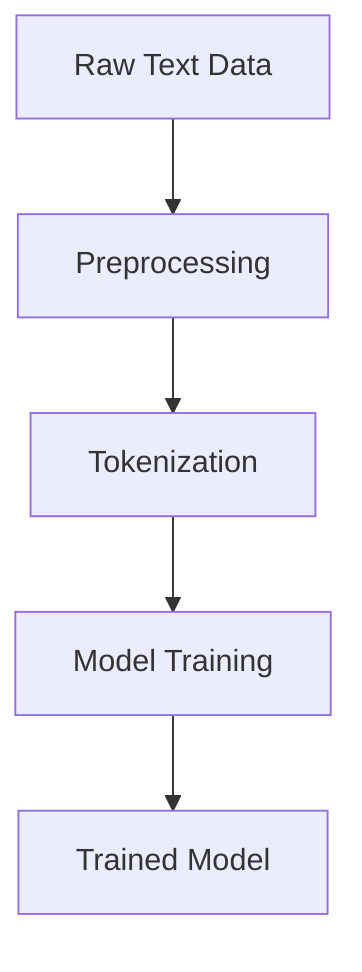
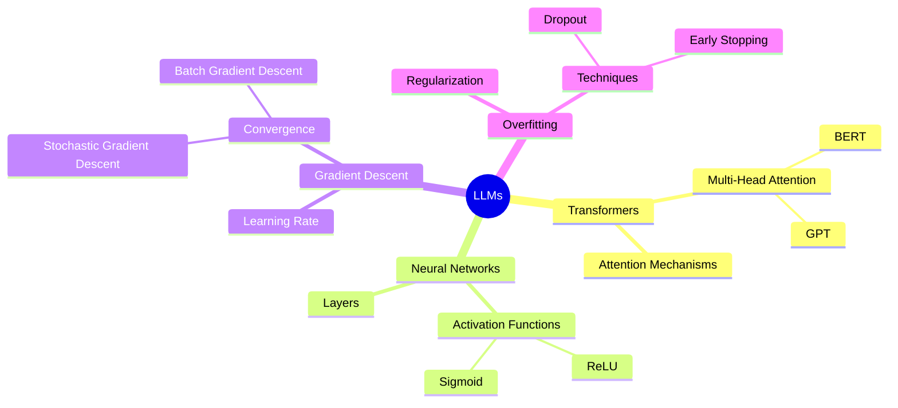
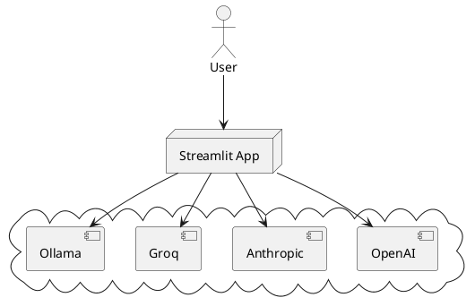

---
# You can also start simply with 'default'
theme: seriph
# random image from a curated Unsplash collection by Anthony
# like them? see https://unsplash.com/collections/94734566/slidev
background: https://cover.sli.dev
# some information about your slides (markdown enabled)
title: Streamlit Multichat PPT
info: |
  ## Slidev Starter Template
  Presentation slides for developers.

  Learn more at [Sli.dev](https://sli.dev)
# apply unocss classes to the current slide
class: text-left
# https://sli.dev/custom/highlighters.html
highlighter: shiki
# https://sli.dev/guide/drawing
drawings:
  persist: false
# slide transition: https://sli.dev/guide/animations#slide-transitions
transition: slide-left
# enable MDC Syntax: https://sli.dev/guide/syntax#mdc-syntax
mdc: true
---

# Streamlit MultiChat

Chat with multiple LLMs from one App.

<div class="pt-12">
  <span @click="$slidev.nav.next" class="px-2 py-1 rounded cursor-pointer" hover="bg-white bg-opacity-10">
    Press Space and Check how it's built <carbon:arrow-right class="inline"/>
  </span>
</div>

<div class="abs-br m-6 flex gap-2">
  <button @click="$slidev.nav.openInEditor()" title="Open in Editor" class="text-xl slidev-icon-btn opacity-50 !border-none !hover:text-white">
    <carbon:edit />
  </button>
  <a href="https://github.com/JAlcocerT/Streamlit-Multichat" target="_blank" alt="GitHub" title="Open in GitHub"
    class="text-xl slidev-icon-btn opacity-50 !border-none !hover:text-white">
    <carbon-logo-github />
  </a>
</div>

<!--
The last comment block of each slide will be treated as slide notes. It will be visible and editable in Presenter Mode along with the slide. [Read more in the docs](https://sli.dev/guide/syntax.html#notes)
-->


---
layout: two-cols
layoutClass: gap-16
---

# Why Streamlit for a MultiChat App?

Streamlit can help to create a unified MultiChat app with Language Learning Models (LLMs)

- 🔄 **Unified Experience** - Select different LLM providers from one place, without switching between platforms.
- 👥 **Multi-User Support** - Handle multiple users and conversations at once.
- 🛠 **Customizable** - Easily adapt the app to different learning methods and requirements.
- 🌐 **Web-Based** - Access your MultiChat app from anywhere, on any device.

::right::

<Toc v-click minDepth="1" maxDepth="2"></Toc>

---
transition: fade-out
---

# What is Streamlit?

Streamlit is a fast, user-friendly tool to create custom web apps for machine learning and data science, offering the following features:

- 📝 **Code-based** - Create web apps using Python scripts, focusing on data and models first.
- 🎨 **Customizable** - Easily design your app's layout and appearance.
- 🧑‍💻 **Developer Friendly** - Built for developers with features like hot-reloading and modular code.
- 🤹 **Interactive** - Easily add widgets like sliders, dropdowns, and buttons to interact with your data.
- 📊 **Data-Ready** - Built-in support for displaying data frames, charts, and other visualizations.
- 🚀 **Fast Deployment** - One-click deployment to share your apps with the world.


<br>
<br>

Read more about [Why Streamlit?](https://streamlit.io/why-streamlit)


<!--
You can have `style` tag in markdown to override the style for the current page.
Learn more: https://sli.dev/guide/syntax#embedded-styles
-->

<style>
h1 {
  background-color: #2B90B6;
  background-image: linear-gradient(45deg, #4EC5D4 10%, #146b8c 20%);
  background-size: 100%;
  -webkit-background-clip: text;
  -moz-background-clip: text;
  -webkit-text-fill-color: transparent;
  -moz-text-fill-color: transparent;
}
</style>

<!--
Here is another comment.
-->

---
transition: slide-up
level: 2
---

# What's based on?

Hover on the bottom-left corner to see the navigation's controls panel, [learn more](https://sli.dev/guide/navigation.html)

## Supported LLMs

|     |     |
| --- | --- |
| <kbd>OpenAI API</kbd> | Most Popular Propietary LLMs (ATM) |
| <kbd>Anthropic API</kbd>  | The challenger of the Throne |
| <kbd>Groq API</kbd> | Fast Inference with Free Models |
| <kbd>Ollama API</kbd> | Also local LLMs! |


---
layout: image-right
image: https://cover.sli.dev
---

# Code

Use code snippets and get the highlighting directly....

```py {all|5|7|7-8|10|all} twoslash
import streamlit as st

# Create a slider widget
slider_value = st.slider('Select a value:', 0, 10)

# Display the selected value
st.write(f'You selected {slider_value}')
```

<arrow v-click="[4, 5]" x1="350" y1="310" x2="195" y2="334" color="#953" width="2" arrowSize="1" />


<!-- Footer -->
[^1]: [Learn More](https://sli.dev/guide/syntax.html#line-highlighting)

<!-- Inline style -->
<style>
.footnotes-sep {
  @apply mt-5 opacity-10;
}
.footnotes {
  @apply text-sm opacity-75;
}
.footnote-backref {
  display: none;
}
</style>

<!--
Notes can also sync with clicks

[click] This will be highlighted after the first click

[click] Highlighted with `count = ref(0)`

[click:3] Last click (skip two clicks)
-->

---
level: 2
---

# How it Works

Powered by [shiki-magic-move](https://shiki-magic-move.netlify.app/), Slidev supports animations across multiple code snippets.

Add multiple code blocks and wrap them with <code>````md magic-move</code> (four backticks) to enable the magic move. For example:

````md magic-move {lines: true}
```py {*|2|*}
#step 1 - The code checks the API Keys
if 'OPENAI_API_KEY' in st.secrets and len(st.secrets['OPENAI_API_KEY']) > 30:
    st.success('API key already provided!', icon='✅')
    openai.api_key = st.secrets['OPENAI_API_KEY']
else:
    openai.api_key = st.text_input('Enter OpenAI API token:', type='password')
    if not (openai.api_key.startswith('sk-') and len(openai.api_key) > 30):
        st.warning('Please, enter your credentials', icon='⚠️')
    else:
        st.success('Proceed with your Prompts!', icon='👉')
```

```py {*|1-2|3-4|3-4,8}
// step 2 - We indicate the API compatible LLMs
model_choice = st.selectbox(
            'Choose the model:',
            ['gpt-3.5-turbo', 'gpt-4-turbo-preview', 'gpt-4o'],
            index=0
        )
```

```py
# step 3 - And we add the possibility to tweak the 'Creativity'
temperature = st.slider(
    'Select temperature for the model:',
    min_value=0.0,
    max_value=1.0,
    value=0.7,
    step=0.01
)
```

Non-code blocks are ignored. This is Ignored!

```vue
for response in openai.ChatCompletion.create(
                model=model_choice,
                messages=[{"role": m["role"], "content": m["content"]}
                          for m in st.session_state.messages], 
                temperature=temperature,  # Use the selected temperature here
                stream=True):
                full_response += response.choices[0].delta.get("content", "")
                message_placeholder.markdown(full_response + "▌")
            message_placeholder.markdown(full_response)
```
````

---

# Components

<div grid="~ cols-2 gap-4">
<div>

You can use Vue components directly inside your slides.

We have provided a few built-in components like `<Tweet/>` and `<Youtube/>` that you can use directly. And adding your custom components is also super easy.

```html
<Counter :count="10" />
```

<!-- ./components/Counter.vue -->
<Counter :count="10" m="t-4" />

Check out [the guides](https://sli.dev/builtin/components.html) for more.

</div>
<div>

We had very recent anouncements...

<Tweet id="1803790676988920098" scale="0.45" />

</div>
</div>

<!--
Presenter note with **bold**, *italic*, and ~~striked~~ text.

Also, HTML elements are valid:
<div class="flex w-full">
  <span style="flex-grow: 1;">Left content</span>
  <span>Right content</span>
</div>
-->

---
class: px-20
---

# Themes

Slidev comes with powerful theming support. Themes can provide styles, layouts, components, or even configurations for tools. Switching between themes by just **one edit** in your frontmatter:

<div grid="~ cols-2 gap-2" m="t-2">

```yaml
---
theme: default
---
```

```yaml
---
theme: seriph
---
```


</div>

Read more about [How to use a theme](https://sli.dev/themes/use.html) and
check out the [Awesome Themes Gallery](https://sli.dev/themes/gallery.html).

---

# Clicks Animations

You can add `v-click` to elements to add a click animation.

<div v-click>

This shows up when you click the slide:

```html
<div v-click>This shows up when you click the slide.</div>
```

</div>

<br>

<v-click>

The <span v-mark.red="3"><code>v-mark</code> directive</span>
also allows you to add
<span v-mark.circle.orange="4">inline marks</span>
, powered by [Rough Notation](https://roughnotation.com/):

```html
<span v-mark.underline.orange>inline markers</span>
```

</v-click>

<div mt-20 v-click>

[Learn More](https://sli.dev/guide/animations#click-animations)

</div>

---

# Motions

Motion animations are powered by [@vueuse/motion](https://motion.vueuse.org/), triggered by `v-motion` directive.

```html
<div
  v-motion
  :initial="{ x: -80 }"
  :enter="{ x: 0 }"
  :click-3="{ x: 80 }"
  :leave="{ x: 1000 }"
>
  Slidev
</div>
```

<div class="w-60 relative">
  <div class="relative w-40 h-40">
    
    
    
  </div>

  <div
    class="text-5xl absolute top-14 left-40 text-[#2B90B6] -z-1"
    v-motion
    :initial="{ x: -80, opacity: 0}"
    :enter="{ x: 0, opacity: 1, transition: { delay: 2000, duration: 1000 } }">
    Slidev
  </div>
</div>

<!-- vue script setup scripts can be directly used in markdown, and will only affects current page -->
<script setup lang="ts">
const final = {
  x: 0,
  y: 0,
  rotate: 0,
  scale: 1,
  transition: {
    type: 'spring',
    damping: 10,
    stiffness: 20,
    mass: 2
  }
}
</script>

<div
  v-motion
  :initial="{ x:35, y: 30, opacity: 0}"
  :enter="{ y: 0, opacity: 1, transition: { delay: 3500 } }">

[Learn More](https://sli.dev/guide/animations.html#motion)

</div>

---

# LaTeX

LaTeX is supported out-of-box. Powered by [KaTeX](https://katex.org/).

<div h-3 />

$$
\theta = \theta - \alpha \cdot \nabla_\theta J( \theta),
$$

[Learn more](https://sli.dev/guide/syntax#latex)

---

# Diagrams

You can create diagrams / graphs from textual descriptions, directly in your Markdown.

<div class="grid grid-cols-4 gap-5 pt-4 -mb-6">








</div>

[Learn More](https://sli.dev/guide/syntax.html#diagrams)

# Monaco Editor

Slidev provides built-in Monaco Editor support.

Add `{monaco}` to the code block to turn it into an editor:

```ts {monaco}
import { ref } from 'vue'
import { emptyArray } from './external'

const arr = ref(emptyArray(10))
```

Use `{monaco-run}` to create an editor that can execute the code directly in the slide:

```ts {monaco-run}
import { version } from 'vue'
import { emptyArray, sayHello } from './external'

sayHello()
console.log(`vue ${version}`)
console.log(emptyArray<number>(10).reduce(fib => [...fib, fib.at(-1)! + fib.at(-2)!], [1, 1]))
```

---
layout: center
class: text-center
---

# Learn More

[Documentation](https://sli.dev) · [GitHub](https://github.com/slidevjs/slidev) · [Showcases](https://sli.dev/showcases.html)

<PoweredBySlidev mt-10 />
